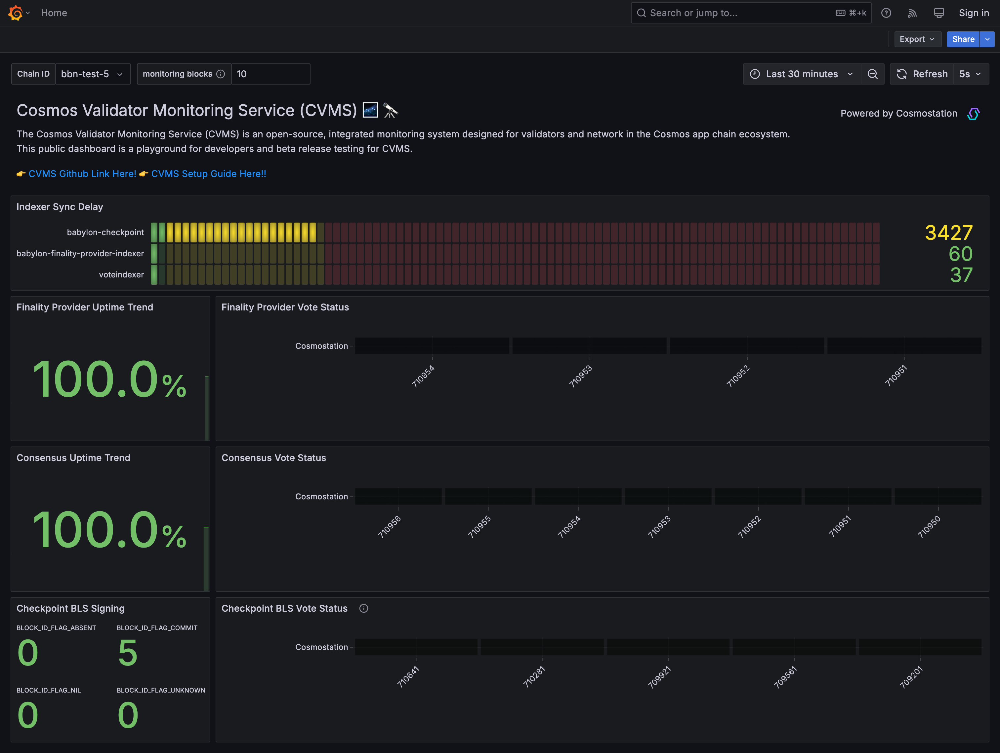
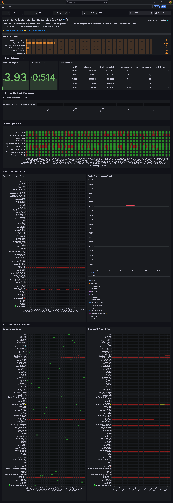
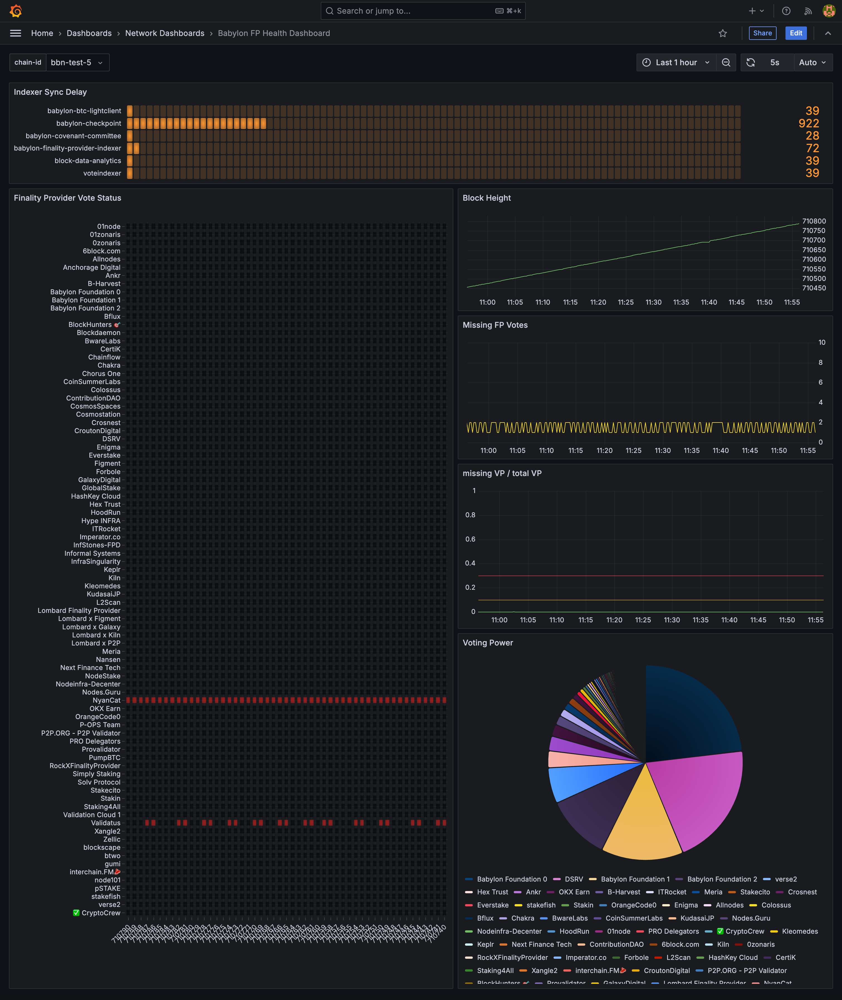

# Babylon Chain Setup Documentation

## Overview

The Babylon chain introduces additional monitoring requirements to support its unique application-specific purposes, such as **BTC Staking** and the **Bitcoin Security Network (BSN)**.

As a **validator**, you need to monitor specific metrics, like [BLS signing](https://github.com/babylonlabs-io/babylon/blob/main/x/checkpointing/README.md), in every `epoch + 1` block.

For validators participating as **Finality Providers (FPs)**, it's also critical to monitor [finality voting](https://github.com/babylonlabs-io/babylon/blob/main/x/finality/README.md) on every block to ensure the proper functioning of Babylon's finality-gadget.

This guide explains how to use **CVMS (Cosmos Validator Monitoring System)** to effectively monitor your validator's metrics for both roles (validator and finality-provider) in Babylon.

## Setup Instructions

### For Validator & Finality Provder

**NOTE: Copy the `.env` file if you need to customize service ports, log-level, prometheus.yaml or other configurations.**

```bash
# clone
git clone https://github.com/cosmostation/cvms.git && cd cvms

# Create a config file from example config
cp .resource/example-validator-config.yaml config.yaml

# Create a env file to make grafana default dashboard for Babylon
cp .resource/.env.example .env

# Modify the config file for your validator
# You can just follow bottom example for your validator instead of Cosmostation moniker
vi config.yaml

# Modify in your .env
GRAFANA_HOME_DASHBOARD=/etc/grafana/provisioning/dashboards/validator/babylon_validator_fp_dashboard.json

# Run cvms
docker compose up --build -d

# Explorer sample dashboard at http://localhost:3000
```

**Example config.yaml for validator mode**

```yaml
# NOTE: Customize this variables by your needs
# 1. network mode:
#   ex) monikers: ['all']
#   des) This will enable network mode to monitor all validators status in the blockchain network
#
# 2. validator mode:
#   ex) monikers: ['Cosmostation1', 'Cosmostation2']
#   des) This will enable validator mode for whitelisted specific validators
monikers: ['Cosmostation']

# If the user is a validator, they will want to operate on all chains in which they are already participating as a validator in the network.
chains:
  # NOTE: display name will be used only this config to indicate followed arguments to communicate internal team members
  - display_name: 'babylon-testnet'
    # NOTE: chain_id is a KEY to find applicable packages in support_chains list. YOU SHOULD MATCH CORRECT CHAIN ID!
    chain_id: bbn-test-5
    # NOTE: these addresses will be used for balance usage tracking such as validator, broadcaster or something.
    tracking_addresses:
      - 'bbn1x5wgh6vwye60wv3dtshs9dmqggwfx2ldy7agnk' # your fp orchestrator address or validator address to follow your gas balance
    nodes:
      # NOTE: currently grpc endpoint doesn't support ssl
      - rpc: 'http://localhost:26657'
        api: 'http://localhost:1337'
        grpc: 'localhost:9090' # actully not used in babylon chain
```

**Example Validator Dashboard**



### For Network & Chain Maintainer

**NOTE: Copy the `.env` file if you need to customize service ports, log-level, prometheus.yaml or other configurations.**

```bash
# clone
git clone https://github.com/cosmostation/cvms.git && cd cvms

# Create a config file from example config
cp .resource/example-validator-config.yaml config.yaml

# Create a env file to make grafana default dashboard for Babylon
cp .resource/.env.example .env

# Modify the config file for your validator
# You can just follow bottom example for your validator instead of Cosmostation moniker
vi config.yaml

# Modify in your .env
GRAFANA_HOME_DASHBOARD=/etc/grafana/provisioning/dashboards/network/babylon_dashboard.json

# Run cvms
docker compose up --build -d

# Explorer sample dashboard at http://localhost:3000
```

**Example config.yaml for validator mode**

```yaml
# NOTE: Customize this variables by your needs
# 1. network mode:
#   ex) monikers: ['all']
#   des) This will enable network mode to monitor all validators status in the blockchain network
#
# 2. validator mode:
#   ex) monikers: ['Cosmostation1', 'Cosmostation2']
#   des) This will enable validator mode for whitelisted specific validators
monikers: ['all']

# If the user is a validator, they will want to operate on all chains in which they are already participating as a validator in the network.
chains:
  # NOTE: display name will be used only this config to indicate followed arguments to communicate internal team members
  - display_name: 'babylon-testnet'
    # NOTE: chain_id is a KEY to find applicable packages in support_chains list. YOU SHOULD MATCH CORRECT CHAIN ID!
    chain_id: bbn-test-5
    # NOTE: these addresses will be used for balance usage tracking such as validator, broadcaster or something.
    tracking_addresses:
      - 'bbn1x5wgh6vwye60wv3dtshs9dmqggwfx2ldy7agnk' # your fp orchestrator address or validator address to follow your gas balance
    nodes:
      # NOTE: currently grpc endpoint doesn't support ssl
      - rpc: 'http://localhost:26657'
        api: 'http://localhost:1337'
        grpc: 'localhost:9090' # actully not used in babylon chain
```

**_NOTE : If you want to use external postgres DB for persistence mode, please check docs/setup_persistent_mode.md docs_**

**Example Babylon Network Dashboard**



**Example Babylon FP Dashboard**



## Alerts

You can explore some rules to monitor your validator signings(BLS & CometBFT) and Finality Provider voting.

👉 https://github.com/cosmostation/cvms/blob/develop/docker/prometheus/rules/babylon.yaml

That rules are already integrated into the CVMS service. so Just make your own alertmanger config file for yours.
